<a id="readmeTop"></a>

<br />
<div align="center">
  <a href="https://github.com/SACJYhpt/StockBucks">
    
  </a>

  <h3 align="center">STOCKBUCKS</h3>

  <p align="center">
    一款多功能的股市模擬交易系統
    <br />
    <br />
    <a href="https://youtu.be/J1qksTC9wtE">Demo Video</a>
    &middot;
    <a href="https://docs.google.com/presentation/d/149NZ8hE4oVvkiBenGghfPWAS2RPeTiZXhdcEhO2shQs/edit?slide=id.p1#slide=id.p1">Report PPT</a>
    &middot;
    <a href="https://github.com/SACJYhpt/StockBucks">Explore Files</a>
  </p>
</div>

<!-- TABLE OF CONTENTS -->
<details>
  <summary>點我展開目錄</summary>
  <ol>
    <li>
      <a href="#aboutTheProject">關於本專案</a>
      <ul>
        <li><a href="#coreFeatures">核心亮點與功能</a></li>
        <li><a href="#builtWith">開發環境</a></li>
        <li><a href="#structure">專案架構與 OOP 設計</a></li>
      </ul>
    </li>
    <li>
      <a href="#howToStart">環境建置與啟動</a>
      <ul>
        <li><a href="#prerequisites">前期準備</a></li>
        <li><a href="#byVSCode">使用 VS Code</a></li>
        <li><a href="#byTerminal">使用 mvn</a></li>
      </ul>
    </li>
    <li>
      <a href="#howToUse">系統操作展示</a>
      <ul>
        <li><a href="#introduce">如何使用</a></li>
        <li><a href="#order">如何下單</a></li>
        <li><a href="#export">紀錄匯出</a></li>
      </ul>
    </li>
    <li><a href="#future">未來優化藍圖</a></li>
    <li><a href="#Team">開發人員</a></li>
  </ol>
</details>

<!-- ABOUT THE PROJECT -->
<h2 id="aboutTheProject">關於本專案</h2>

<h3 id="coreFeatures">核心亮點與功能</h3>

對於其他也是模擬盤的具有以下優勢:
* 打破時間限制：解決⽬前模擬系統僅限於「即時盤」(9:00~13:30)的問題。讓學⽣與上班族能隨時練習，不再錯過實戰經驗。
* 降低入場門檻：將複雜的系統簡化成部分功能，藉由基礎功能學會市場邏輯。
* 實戰化的模擬起點：無論零股或整張，讓使⽤者學習分散投資與⾵險控管。每⼀筆交易都計算⼿續費與稅⾦，真實還原市場交易成本。
* 暢遊現實或虛擬數據：使⽤或現實或虛擬的數據來顯⽰數據

「投資最好的時間是十年前，其次是現在。」 - Dambisa Moyo

雖然我們無法回到十年前，但是我們可以對於「過去」隨時進行模擬！

同時體驗時間複利的威力、建立進出場限制與紀律


<p align="right">(<a href="#readmeTop">回到頂端</a>)</p>

<h3 id="builtWith">開發環境</h3>

本專案主要由 JAVA 寫成。

<a href="https://www.oracle.com/tw/java/technologies/downloads/#java21">
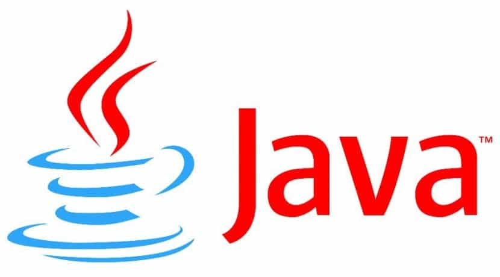  JAVA 21 (點擊前往下載)
</a>

<p align="right">(<a href="#readmeTop">回到頂端</a>)</p>

<h3 id="structure">專案架構與 OOP 設計</h3>

以下展現專案主要資料夾、程式結構以及內容概述。

```
📂 StockBucks/
├── 📂 data/
│   └── TestDataTSMC.csv  # 初始測試用的台積電近五年股票數據
├── 📂 images/       # 用以儲存 readme 之圖片
├── 📂 src/
│   ├── 📂 main/
│   │   ├── 📂 java/com/stockbucks/
│   │   │   ├── 📂 api/
│   │   │   │   └── 📄 AIHub.java    # 串接 AI、API 之接口
│   │   │   ├── 📂 gui/
│   │   │   │   ├── 📄 CandleStickChart.java   # K 線圖元件
│   │   │   │   ├── 📄 MainApp.java            # 最主要 UI 撰寫地
│   │   │   │   ├── 📄 MainController.java     # 初期測試 UI 用之程式 
│   │   │   │   └── 📄 WelcomeUI.java          # 歡迎窗口
│   │   │   ├── 📄 App.java                # 專案執行之主程式
│   │   │   ├── 📄 CsvLoading.java         # 用以處理 .csv 檔案之讀取
│   │   │   ├── 📄 Order.java              # 單一筆委託單之物件 (股票、日期、金額等)
│   │   │   ├── 📄 PriceSimulator.java     # 價格模擬程式 (算法模擬出單日價格等)
│   │   │   ├── 📄 SaveData.java           # 用以儲存資料
│   │   │   ├── 📄 SaveManager.java        # 將資料轉成檔案儲存於本地端
│   │   │   ├── 📄 SettlementManager.java  # 交割處理之物件 (處理交割金額數據等)
│   │   │   ├── 📄 StockData.java          # 股票資料之物件 (開收高低等數據儲存)
│   │   │   ├── 📄 StockHoldings.java      # 個人持股之物件 (管理持股數量成本等)
│   │   │   ├── 📄 TradeRecord.java        # 交易紀錄之物件 (儲存交易紀錄等)
│   │   │   ├── 📄 TradingEngine.java      # 交易引擎之物件 (委託買賣撮合等)
│   │   │   └── 📄 User.java               # 用戶之物件 (金額、持股管理等)
│   │   └── 📂 resources/com/stockbucks/gui
│   │       ├── 📄 main_view.fxml
│   │       └── 📄 stonks-meme.gif         # 歡迎窗口之 GIF 檔案
│   └── 📂 test/java/com/stockbucks/
│       └── 📄 AppTest.java
├── 📄 pom.xml
└── 📄 stockbucks_ai.db
```

<p align="right">(<a href="#readmeTop">回到頂端</a>)</p>

<!-- HOW TO START -->
<h2 id="howToStart">環境建置與啟動</h2>

<h3 id="prerequisites">前期準備</h3>

本專案為 Maven 專案，請先確認電腦已安裝 **JDK 21** (或 JDK 17 以上版本)。

也請先將內容 clone 下來：

1. 先打開電腦的終端機 (Windows: 命令提示字元 CMD、PowerShell；Mac: Terminal)

2. 切換至想要放專案的地方 (以桌面為例)：

    ```
    cd Desktop 
    ```

3. 開始 clone：

    ```
    git clone https://github.com/SACJYhpt/StockBucks.git
    ```


<p align="right">(<a href="#readmeTop">回到頂端</a>)</p>

<h3 id="byVSCode">使用 VS Code</h3>

1. 在開始之前，請確保您的電腦具備以下之 **VS Code 必備擴充套件**:

    Extension Pack for Java (微軟官方 Java 擴充套件包)

    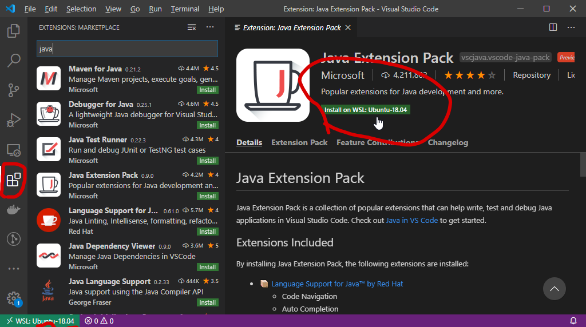

2. 點擊 VS Code 的「開啟資料夾 (Open Folder)」，**務必直接選擇 ```StockBucks``` 根目錄資料夾**開啟

3. 依序點開左側路徑 ```src/main/java/com/stockbucks/App.java```

4. 直接點擊 ```Run``` 即可開始

    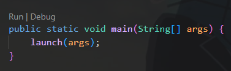


<p align="right">(<a href="#readmeTop">回到頂端</a>)</p>

<h3 id="byTerminal">使用 mvn</h3>


1. 請先編譯與資源同步確認為最新版本

    ```
    mvn clean compile -o
    ```

2. 啟動 JavaFX 視窗主程式

    ```
    mvn javafx:run -o
    ```

如果沒有 ```mvn``` 請參考：<a href="https://ithelp.ithome.com.tw/m/articles/10260305">如何下載mvn？</a>

<p align="right">(<a href="#readmeTop">回到頂端</a>)</p>

<h2 id="howToUse">系統操作展示</h2>

<h3 id="introduce">版面介紹</h3>

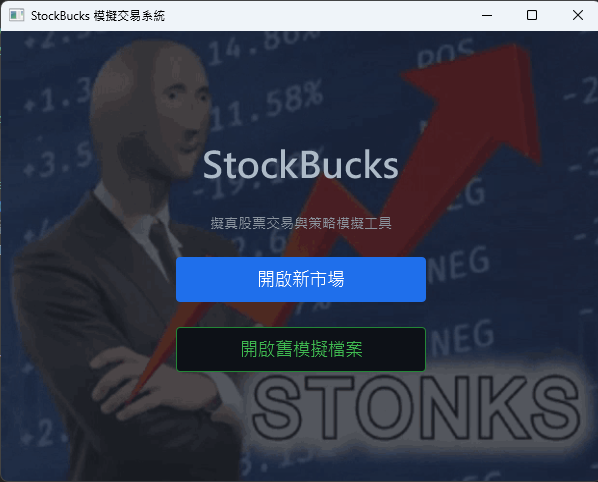

按上方 ```開啟新市場``` 即可選擇運行模式：
 * 真實即時模式：串接即時 API，體驗當前市場的真實波動與報價速度
 * 歷史回測模式：時空加速功能，⼀⼩時內即可模擬完成⼀整年的⾏情⾛勢
 * AI 模擬模式：模擬極端情境，訓練投資者應變能⼒

下方之 ```開啟就模擬檔案``` 可讀取之後之存檔

<p align="right">(<a href="#readmeTop">回到頂端</a>)</p>

進入後將可以看到以下分頁(右側)：

 * 市場行情：股價綜覽，可自行加入 / 移除關注股票

    ▼ 初始畫面

    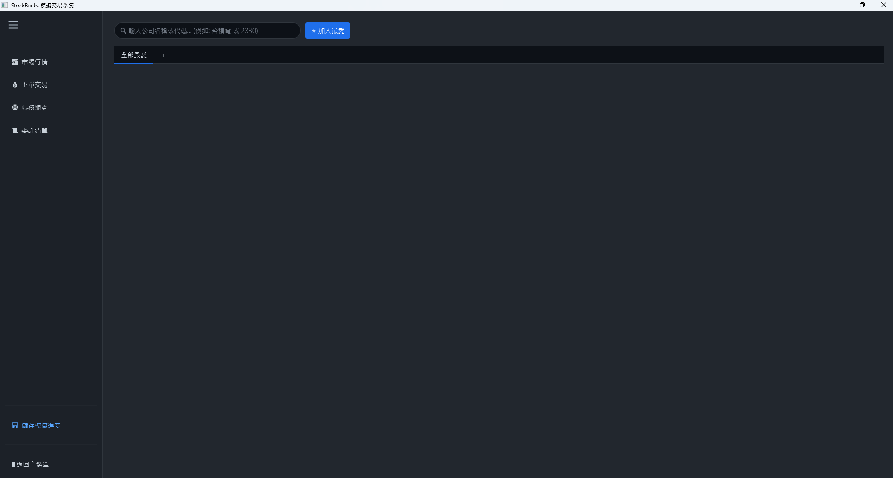
    
    ▼ 加入喜歡的標的

    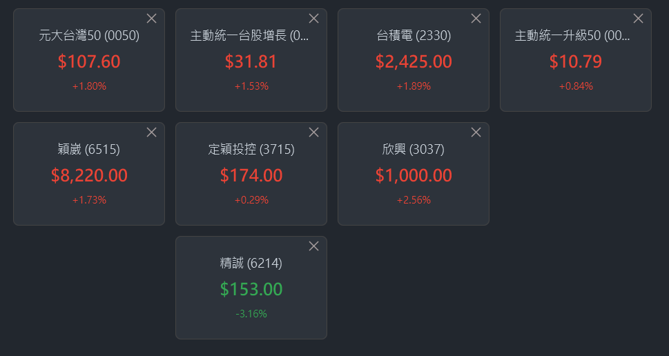

    ▼ 可輸入中文名稱或代號加入

    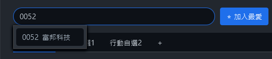
    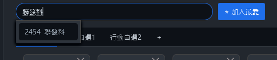
    
 * 下單交易：下單買入 / 賣出股票

    ▼ 初始畫面

    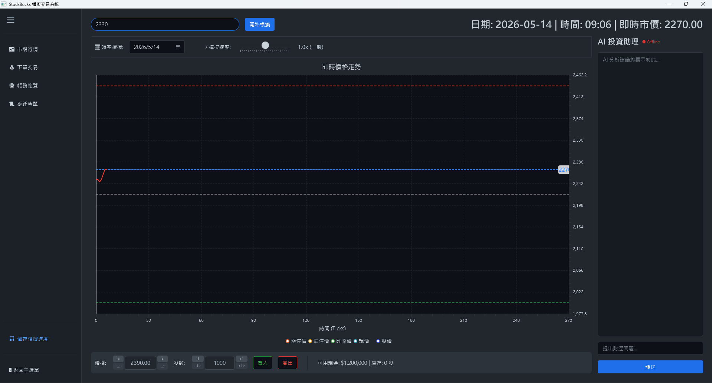

    右上角顯示即時市價，點擊即可帶入左下之限價價格

 * 帳務總覽：可看到持有資產、戶頭餘額、對帳明細

    ▼ 持有標的

    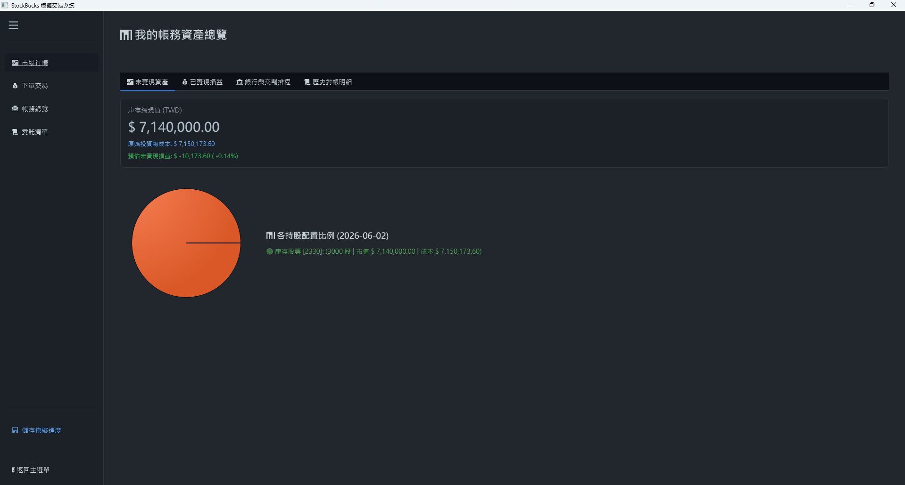
    
    ▼ 已經實現

    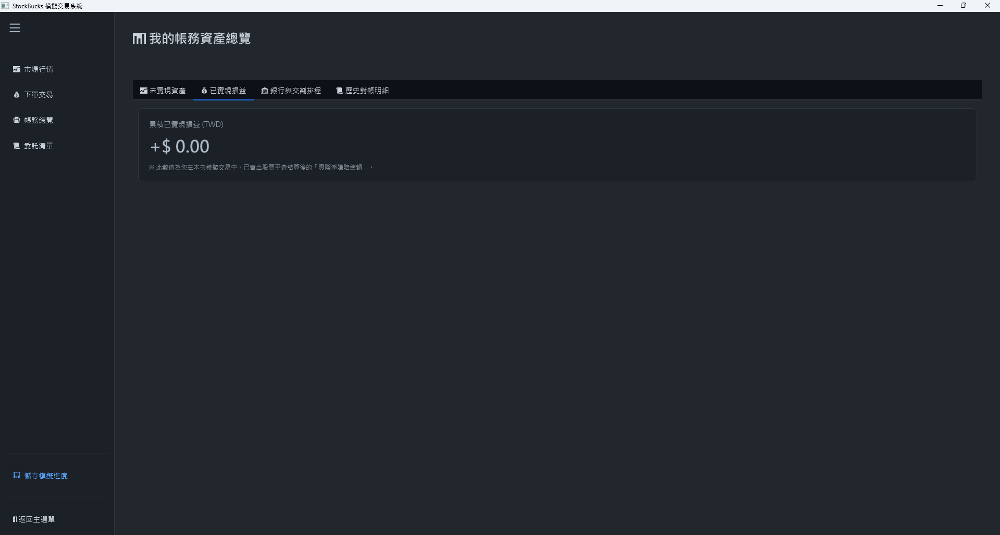

    ▼ 銀行帳戶

    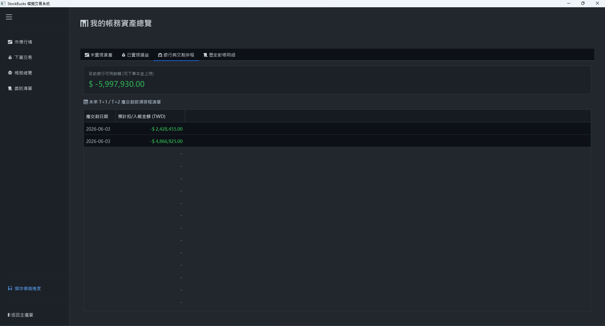
    
    ▼ 歷史資料

    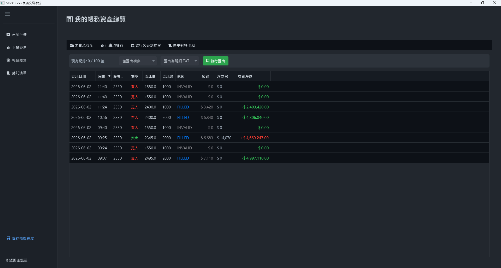

 * 委託清單：委託之清單與成功交易的紀錄

    ▼ 當日委託清單

    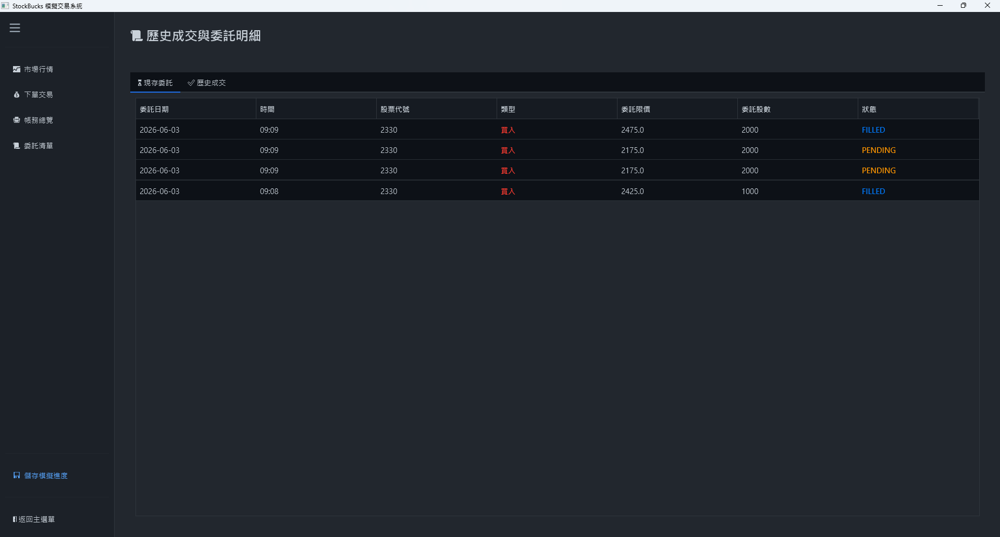
    
    ▼ 已成交清單紀錄

    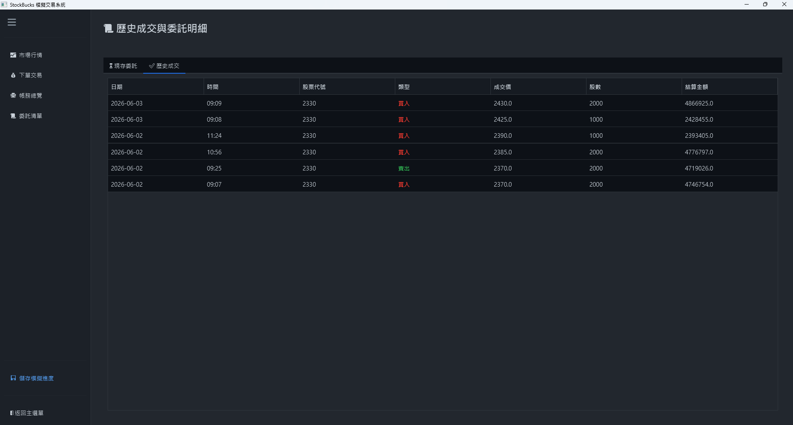

 * 儲存模擬進度：將線有進度儲存下來

    ▼ 儲存進度

    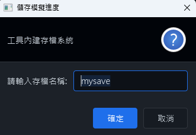


 * 返回主選單：返回原先的選擇清單


<p align="right">(<a href="#readmeTop">回到頂端</a>)</p>

<h3 id="order">如何下單</h3>

▼ 調整限價與委託股數

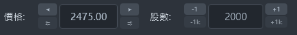

價格上方之左右箭頭可以挑整左右 ```1``` 個 ```tick```，下面則是 ```10``` 個，股數的則是上方之左右箭頭可以加減 ```1``` 股，下面則是 ```1000``` 股 (一張)。

▼ 成功買入

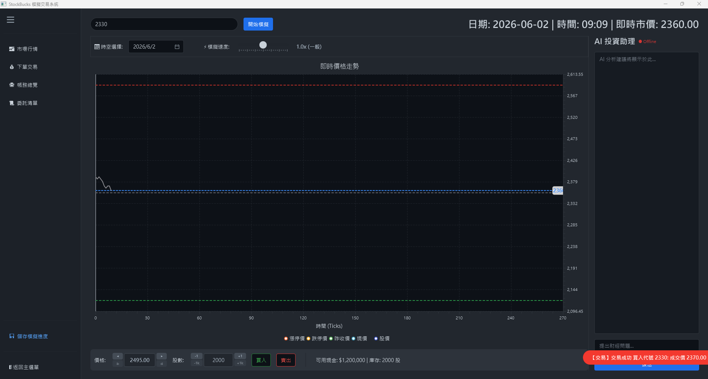

▼ 成功賣出

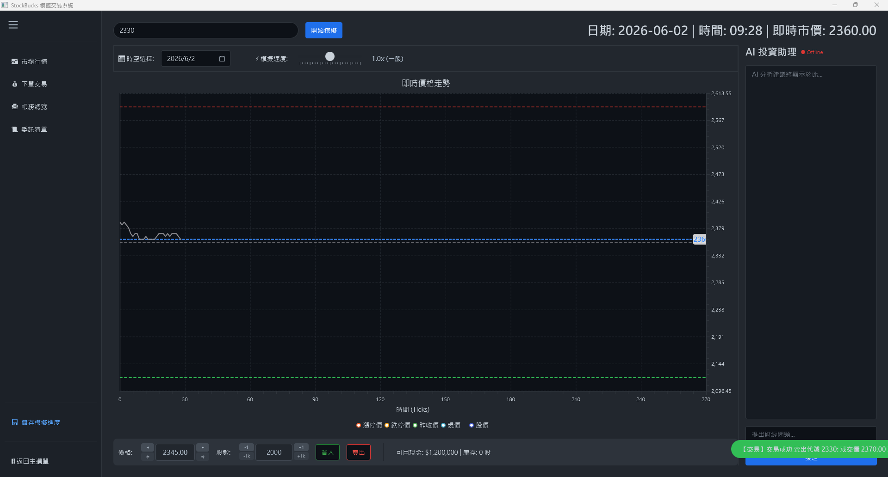

<p align="right">(<a href="#readmeTop">回到頂端</a>)</p>

<h3 id="export">紀錄匯出</h3>

▼ 按下後儲存委託明細資料成txt檔案

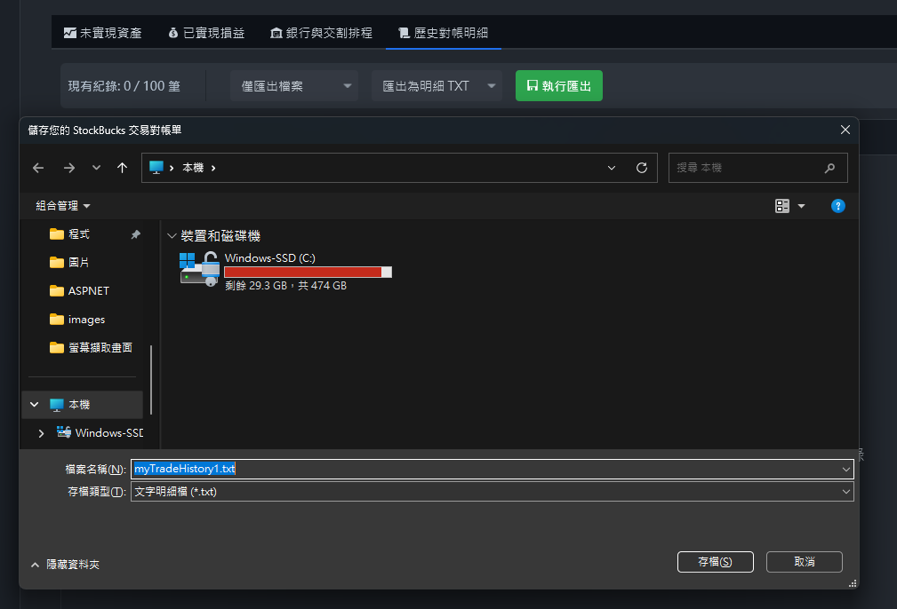

▼ 成功儲存

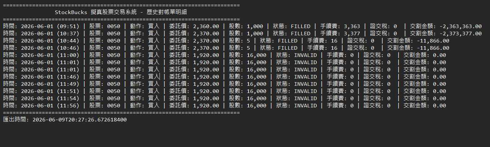


<p align="right">(<a href="#readmeTop">回到頂端</a>)</p>

<h2 id="future">未來優化展望</h2>

雖基本買賣可以完成，但還有更多想要加入的內容，可惜開發時間不足

未來展望會分為優化以及新增功能：

優化：

1. 將操作介面設計更清楚明瞭人性化

2. 讓匯出檔案做更加精美

3. AI 使用更加穩定聰明

新增：

1. 持股建議報告

2. 公司分析報告

3. 更多元交易模式

<p align="right">(<a href="#readmeTop">回到頂端</a>)</p>

<h2 id="Team">開發人員</h2>

以下為專案共同開發人員(按照字典序)：

|<a href="https://github.com/Ryder1207" target="_blank"></a>|<a href="https://github.com/SACJYhpt" target="_blank"></a>|<a href="https://github.com/wwubae" target="_blank">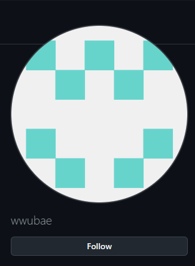</a>|
|:-:|:-:|:-:|
|<a href="https://github.com/Ryder1207" target="_blank">Ryder1207</a>|<a href="https://github.com/SACJYhpt" target="_blank">SACJYhpt</a>|<a href="https://github.com/wwubae" target="_blank">wwubae</a>|

<p align="right">(<a href="#readmeTop">回到頂端</a>)</p>
